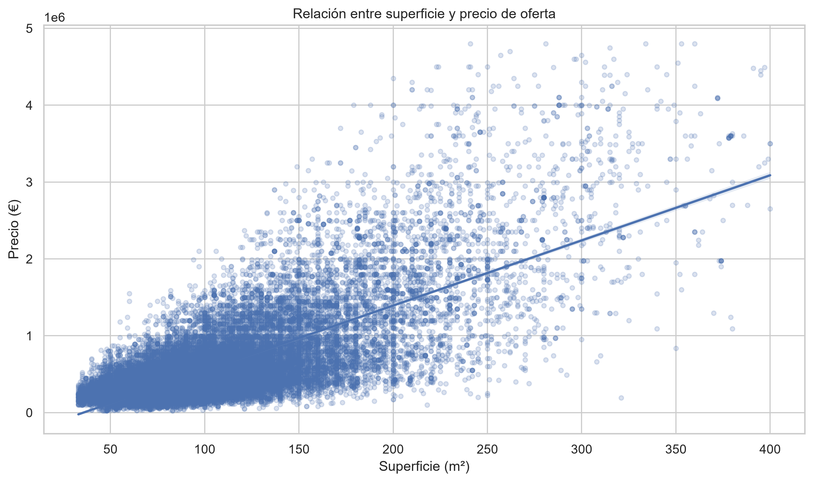
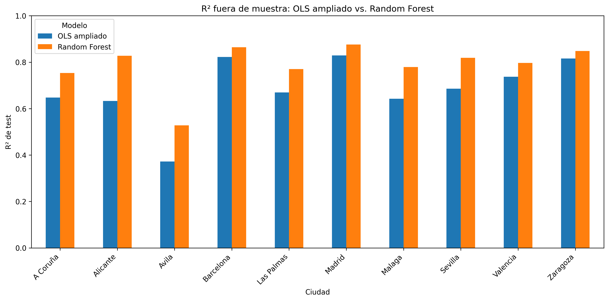

# 🏠 TFM · Análisis inmobiliario entre ciudades españolas

## Asociación de las características de la vivienda en el precio de oferta: un análisis comparativo entre ciudades españolas mediante modelos de predicción

Repositorio de código y resultados reproducibles asociado al **Trabajo Fin de Máster en Big Data y Ciencia de Datos**.

El proyecto estudia la asociación entre las características de las viviendas y su **precio de oferta** en diez ciudades españolas. El análisis combina exploración de datos, modelos de regresión lineal múltiple y un contraste predictivo mediante Random Forest.

---

## 🎯 Objetivo

Analizar qué características estructurales, de equipamiento y localización están más relacionadas con el precio de oferta de la vivienda y comparar hasta qué punto estos patrones son consistentes entre distintos mercados urbanos españoles.

El análisis se realiza de forma independiente para cada ciudad, evitando asumir que todos los mercados inmobiliarios presentan el mismo comportamiento.

---

## 🏙️ Ciudades analizadas

| | | |
|---|---|---|
| A Coruña | Alicante | Ávila |
| Barcelona | Las Palmas | Madrid |
| Málaga | Sevilla | Valencia |
| Zaragoza |  |  |

---

## 🔄 Flujo de trabajo

**Selección e integración de datos**  
↓  
**Preprocesamiento y transformación**  
↓  
**Análisis exploratorio de datos (EDA)**  
↓  
**Modelización OLS por ciudad**  
↓  
**Estandarización Z-score y diagnóstico estadístico**  
↓  
**Validación fuera de muestra 80/20**  
↓  
**Random Forest como benchmark predictivo**  
↓  
**Comparación e interpretación de resultados**

---


### Una primera lectura visual de los datos

<p align="center">
  
</p>

<p align="center">
  <em>Relación entre superficie y precio de oferta en las ciudades analizadas.</em>
</p>

## 📓 Notebooks

| Notebook | Contenido |
|---|---|
| `01_Seleccion_datos.ipynb` | Selección, integración y preparación inicial de los datos. |
| `02_Preprocesamiento_transformacion.ipynb` | Limpieza, tratamiento de variables y transformaciones necesarias para el análisis. |
| `03_Analisis_exploratorio_de_los_datos.ipynb` | Análisis exploratorio, distribuciones, relaciones entre variables y generación de figuras y tablas descriptivas. |
| `04_Modelizacion_regresiones_por_ciudad_zscore_train_test_random_forest_FINAL.ipynb` | Modelos OLS base y ampliado, Z-score, diagnósticos, validación 80/20 y Random Forest. |

Los notebooks están numerados según su **orden de ejecución**.

---

## 📊 Metodología

### 1. Preparación de datos

El flujo parte de anuncios inmobiliarios correspondientes a las diez ciudades analizadas. Se realizan las tareas de integración, depuración, transformación y selección necesarias antes de la modelización.

Los datos originales no se distribuyen en este repositorio.

### 2. Modelos OLS

Se estiman modelos de **regresión lineal múltiple mediante mínimos cuadrados ordinarios (OLS)** de forma independiente para cada ciudad.

Se comparan dos especificaciones:

- **Modelo base:** variables estructurales y de equipamiento.
- **Modelo ampliado:** incorpora información adicional relevante para explicar el precio de oferta.

Las variables predictoras se estandarizan mediante **Z-score**, lo que facilita la comparación de la magnitud relativa de los coeficientes.

La inferencia se complementa con errores estándar robustos **HC3** y diagnósticos de multicolinealidad, heterocedasticidad y normalidad de residuos.

### 3. Validación fuera de muestra

La capacidad predictiva se evalúa mediante una partición reproducible:

- **80 % entrenamiento**
- **20 % prueba**
- `random_state = 42`

Las operaciones susceptibles de introducir información del conjunto de prueba se calculan utilizando exclusivamente el conjunto de entrenamiento, evitando **data leakage**.

Las principales métricas utilizadas son:

- **R²**
- **RMSE**
- **MAE**

> **Nota metodológica:** la validación cruzada se considera una posible extensión para estudiar con mayor profundidad la estabilidad de las métricas, pero **no fue ejecutada en el análisis final**. La validación realizada corresponde al esquema holdout 80/20 descrito anteriormente.

### 4. Random Forest

Se incorpora un **Random Forest de 500 árboles** como benchmark predictivo no lineal.

Su función es complementar el análisis OLS y comprobar si un modelo capaz de capturar relaciones no lineales e interacciones mejora el rendimiento fuera de muestra.

Random Forest se utiliza con finalidad **predictiva y comparativa**, no como sustituto de la interpretación inferencial de los modelos OLS.

---

## 📈 Resultados reproducibles

La carpeta [`reports/figures`](reports/figures) contiene las figuras generadas durante el análisis y [`reports/tables`](reports/tables) las tablas exportadas.

Los principales resultados de validación fuera de muestra y comparación predictiva incluyen:

- comparación entre OLS base y ampliado;
- validación train/test;
- métricas fuera de muestra;
- resultados de Random Forest;
- comparación OLS ampliado vs. Random Forest;
- importancias de variables del Random Forest.

### Resultados de validación y comparación predictiva

Los principales resultados de validación fuera de muestra y comparación predictiva se encuentran disponibles en los siguientes archivos:

| Archivo | Contenido |
|---|---|
| `04_validacion_train_test_modelos.csv` | Métricas train/test de los modelos OLS base y ampliado. |
| `04_comparacion_train_test_modelos.csv` | Comparación fuera de muestra entre ambas especificaciones OLS. |
| `04_resultados_random_forest.csv` | Resultados del Random Forest por ciudad. |
| `04_comparacion_ols_random_forest.csv` | Comparación OLS ampliado vs. Random Forest. |
| `04_top5_importancias_random_forest.csv` | Principales importancias del Random Forest por ciudad. |
| `figura_5_09_r2_test_base_ampliado.png` | Comparación del R² de test de los modelos OLS. |
| `figura_5_10_comparacion_ols_random_forest.png` | Comparación de métricas fuera de muestra. |
| `figura_5_11_r2_test_ols_random_forest.png` | Comparación del R² de test: OLS ampliado vs. Random Forest. |


### Comparación predictiva final

<p align="center">
  
</p>

<p align="center">
  <em>Comparación del rendimiento fuera de muestra entre OLS ampliado y Random Forest en las diez ciudades.</em>
</p>

## ✅ Conclusiones principales

- **La superficie es el factor estructural más consistente:** presenta el mayor coeficiente estandarizado en valor absoluto en las diez ciudades en los modelos OLS.
- **La localización importa de forma sistemática:** la distancia al centro presenta una asociación negativa y estadísticamente significativa en las diez ciudades.
- **El modelo OLS ampliado mejora al modelo base** en R² ajustado en las diez ciudades, lo que indica que las características adicionales aportan capacidad explicativa.
- **La validación fuera de muestra confirma en general esa mejora.** Ávila constituye el caso más débil y cuenta, además, con el menor tamaño muestral.
- **Random Forest mejora el rendimiento predictivo fuera de muestra frente al OLS ampliado en las diez ciudades**, con mejores resultados en R², RMSE y MAE.
- **Existe heterogeneidad entre mercados urbanos:** las características de la vivienda no presentan exactamente el mismo peso en todas las ciudades, lo que respalda el análisis separado por ciudad.

> **En conjunto, los modelos lineales permiten identificar e interpretar asociaciones relevantes entre las características de la vivienda y su precio de oferta, mientras que Random Forest aporta una mejora adicional de la capacidad predictiva al capturar relaciones más complejas. Ambos enfoques resultan complementarios.**

---

## 🗂️ Estructura del repositorio

```text
.
├── data/
│   ├── README.md
│   ├── raw/                 # Datos originales no distribuidos
│   └── processed/           # Datos procesados generados durante la ejecución
│
├── notebooks/
│   ├── README.md
│   ├── 01_Seleccion_datos.ipynb
│   ├── 02_Preprocesamiento_transformacion.ipynb
│   ├── 03_Analisis_exploratorio_de_los_datos.ipynb
│   └── 04_Modelizacion_regresiones_por_ciudad_zscore_train_test_random_forest_FINAL.ipynb
│
├── reports/
│   ├── README.md
│   ├── figures/             # Figuras académicas generadas
│   └── tables/              # Tablas académicas generadas
│
├── requirements.txt
├── .gitignore
└── README.md
```

---

## ⚙️ Instalación y reproducción

Para ejecutar el proyecto se recomienda crear un entorno virtual e instalar las dependencias incluidas en `requirements.txt`.

### Windows

```bash
git clone https://github.com/CHAROHF/TFM-Analisis-Inmobiliario.git
cd TFM-Analisis-Inmobiliario
python -m venv .venv
.venv\Scripts\activate
pip install -r requirements.txt
jupyter notebook
```

### Linux / macOS

```bash
git clone https://github.com/CHAROHF/TFM-Analisis-Inmobiliario.git
cd TFM-Analisis-Inmobiliario
python3 -m venv .venv
source .venv/bin/activate
pip install -r requirements.txt
jupyter notebook
```

### Orden de ejecución

Una vez preparado el entorno, los notebooks deben ejecutarse en el siguiente orden:

1. `01_Seleccion_datos.ipynb`
2. `02_Preprocesamiento_transformacion.ipynb`
3. `03_Analisis_exploratorio_de_los_datos.ipynb`
4. `04_Modelizacion_regresiones_por_ciudad_zscore_train_test_random_forest_FINAL.ipynb`

Los notebooks utilizan rutas relativas al proyecto para facilitar su ejecución en distintos equipos.

> **Nota sobre los datos:** los datos originales no se distribuyen en este repositorio. Para reproducir el flujo completo es necesario disponer de los archivos de entrada y situarlos en `data/raw/`, siguiendo las indicaciones de `data/README.md`. Los resultados agregados utilizados en el TFM se conservan en `reports/`.


## 🧰 Tecnologías principales

`Python` · `Jupyter Notebook` · `pandas` · `NumPy` · `statsmodels` · `scikit-learn` · `Matplotlib` · `seaborn`

---

## ⚠️ Alcance e interpretación

Los resultados describen **asociaciones** entre las características observadas y el precio de oferta de los anuncios analizados.

Por tanto:

- no deben interpretarse como relaciones causales;
- el precio estudiado es **precio de oferta**, no precio final de transacción;
- los resultados dependen de la muestra y del periodo analizados;
- Random Forest actúa como contraste predictivo complementario a OLS.

---

## 📁 Datos

Los datos originales no se incluyen en el repositorio. La estructura `data/` se conserva para permitir la reproducción del flujo de trabajo cuando se disponga de los archivos de entrada correspondientes.

---

### Trabajo Fin de Máster · Big Data y Ciencia de Datos VIU

Repositorio preparado para documentar de forma reproducible el código, las tablas y las figuras utilizadas en la versión final del proyecto.
